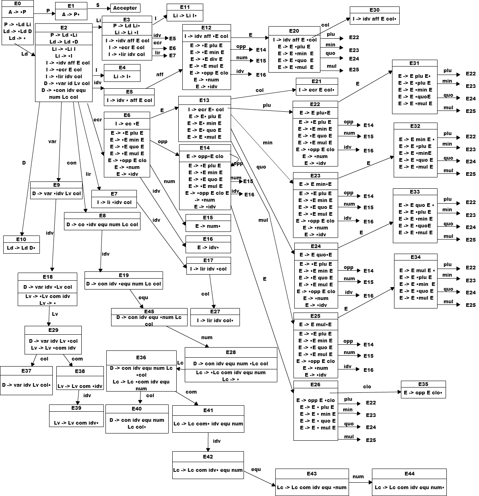

lutcc
=====

This project is to write a LALR parser for a toy language (Lutin), **without**
using a tokenizer or parser tool (such as Lex, YACC or GNU Bison), but instead
building the entire parser using only a regex parsing tool, and standard C++.

Example lutin code
------------------

	var x;
	const n = 10, n2 = 100;

	ecrire n + n2;
	x := n + n2;
	ecrire x + 2;
	lire x;
	ecrire x;

This program declares one variable and two constants, writes `110` to the standard output, affects a value to `x` which is then written, and finally, it writes the user input on the standard output.

Complete description of the language's grammar can be found in [`grammar.md`](./grammar.md), and the project architecture in [`architecture.md`](./architecture.md)

Automaton implementation
------------------------

The automaton implemented was written specifically for this project by our team:

Notes:
------

+ Declarations (`var` and `const`) **must** be done **before** any instruction.
+ `ecrire` means write to standard output, and `lire` means read from standard input.
+ The language only supports **integers**
+ If a litteral is on the right-hand side of an assignment, it can't be negative
+ Constants **must** be initialized with a **positive integer litteral**
+ Variables **may not** be initialized
