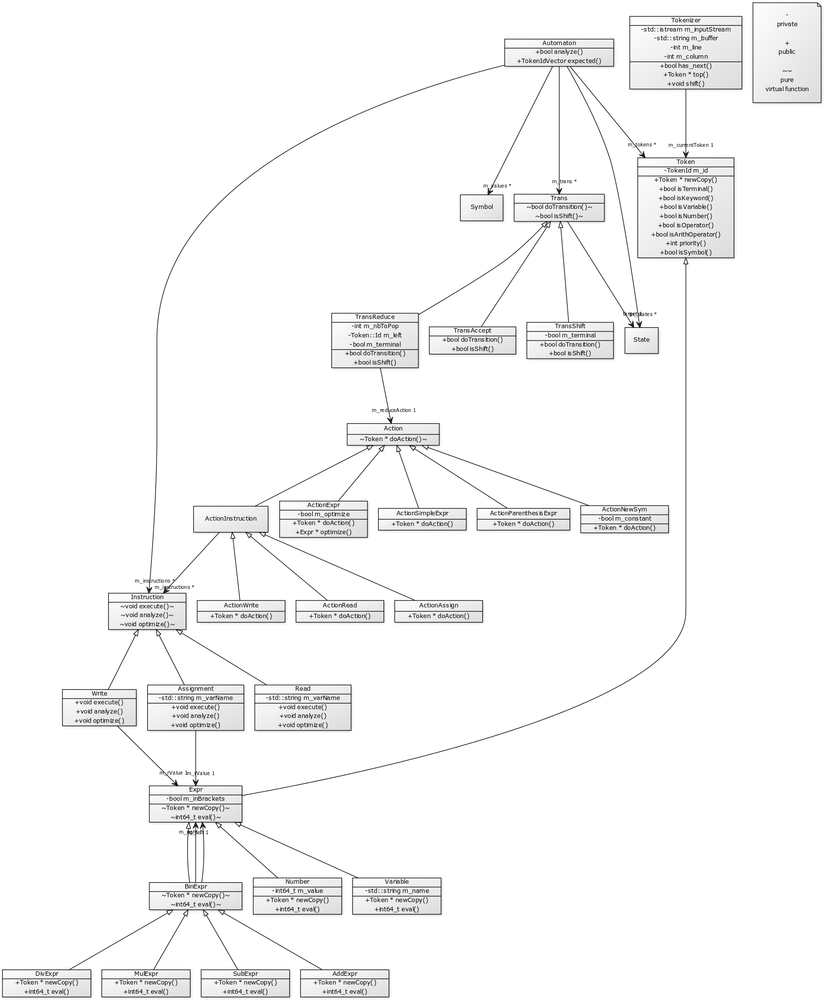

Because the entire automaton technology stack is specific to this project, we need to carefully design the architecture so that it is as usable as possible for the task at hand, and can be easily modified if the constraints were to change.

Here is the class diagram explaining the most important aspects of the architecture:

